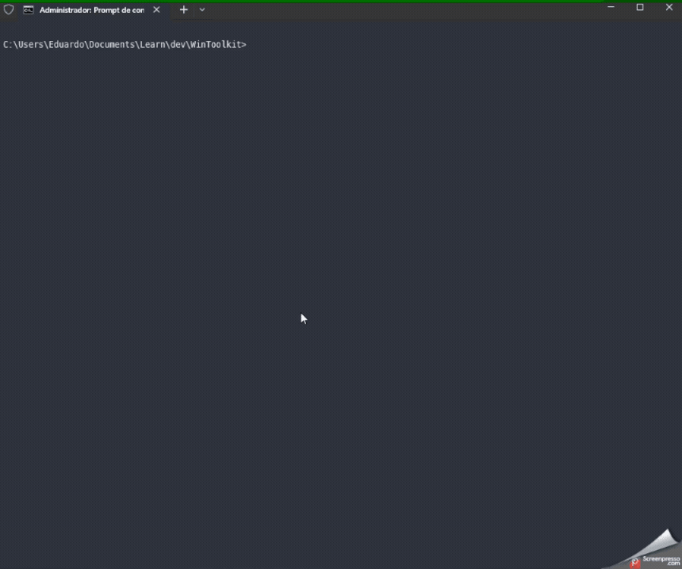

# WinToolkit

> Modular Windows CLI Toolkit

---
## Language

**🇺🇸 English** | [🇧🇷 Português (Brasil)](README.pt-BR.md)

---

## Overview

WinToolkit is a modular Windows CLI toolkit focused on automation, diagnostics, and developer utilities.

What started as a simple batch script evolved into a structured toolkit featuring:

- Dynamic YAML-driven menus
- ANSI-powered terminal UI
- Localization support
- Modular architecture
- PowerShell integration
- Windows utility automation

The goal of the project is to provide a lightweight and extensible command-line environment for Windows power users and developers.

---

## Features

- Dynamic YAML-based menu system
- ANSI terminal interface
- Modular script architecture
- Localization/i18n support
- Windows system utilities
- Network troubleshooting tools
- Developer utilities
- Structured configuration system

---

## Demo



---

## Installation

Run the installer directly from PowerShell:

```powershell
irm https://raw.githubusercontent.com/OeGiaretta/WinToolkit/main/install.ps1 | iex
````

---

## Project Structure

``````txt
WinToolkit/
├── assets/
├── i18n/
├── lib/
│   ├── ui/
│   └── parse_yaml.ps1
├── scripts/
├── install.ps1
├── config.bat
└── WinToolkit.bat
``````

---

## Technologies

* Batch
* PowerShell
* YAML
* Windows Terminal ANSI Escape Sequences

---

## Why I Built This

WinToolkit began as a personal Windows automation script created to simplify repetitive administrative and troubleshooting tasks.

As the project grew, it became clear that the toolkit needed a better structure, modularity, localization support, and a more professional user experience.

This project became an opportunity to transform an old unfinished utility into a scalable CLI toolkit.

---

## The Comeback Story

Originally, WinToolkit was just a collection of batch scripts grouped together without a consistent interface or architecture.

During the GitHub Finish-Up-A-Thon challenge, the project was completely restructured and upgraded with:

* Dynamic menu loading
* YAML-based configuration
* ANSI-powered UI
* Localization system
* Modular organization
* Installer support
* Improved terminal experience

The challenge became the perfect motivation to finally polish and publish the project properly.

---

## Roadmap

* [x] ANSI terminal UI
* [x] Dynamic menus
* [x] YAML-driven configuration
* [x] Localization system
* [x] Installer
* [ ] Plugin system
* [ ] PowerShell modules
* [ ] Package manager support
* [ ] GUI version

---

## GitHub Finish-Up-A-Thon

This project is a submission for the GitHub Finish-Up-A-Thon Challenge.

---

## License

MIT License